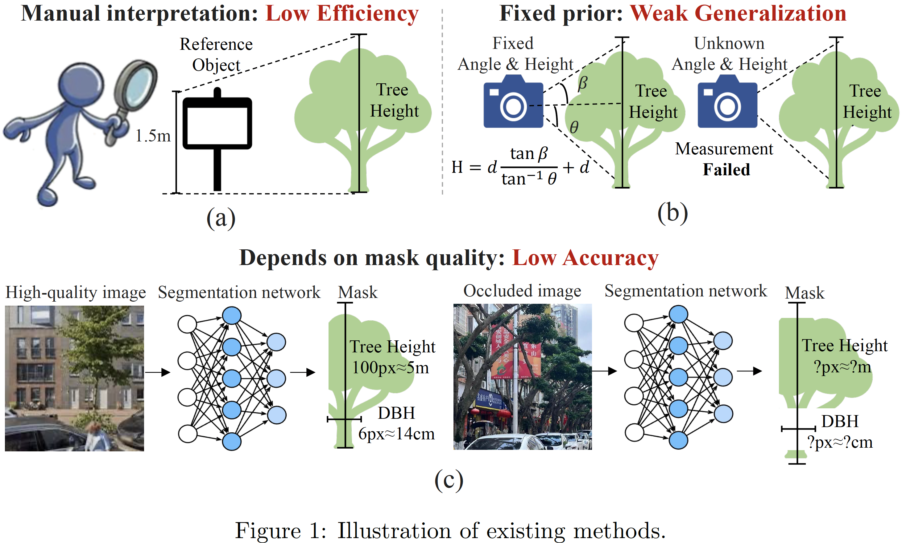

## 🔭 Introduction
<p align="center" style="font-size:18px">
<strong>TSC-Net: A roadside tree structure parameter computation network using street-view images</strong>
</p>


<p align="justify">
<strong>Abstract:</strong> Accurate carbon storage estimation of roadside trees depends on structure parameters such as Diameter at Breast Height (DBH) and Tree Height (TH). Traditional field surveys and LiDAR scanning are either inefficient or expensive. So, we propose an innovative method to compute tree structure parameters using low-cost, high-coverage street-view images. Existing image-based methods often rely on fixed scale priors (e.g., fixed camera height) or require manual interpretation, which results in poor
generalization, low accuracy, and inefficiency. Inspired by how humans understand the
3D world, we integrate semantic and geometric cues to overcome these challenges.
Specifically, we propose the first end-to-end Tree Structure Parameter Computation
Network, named TSC-Net. It makes several contributions: 1) To extract robust
semantic and geometry information, we integrate a decoupled dual-branch feature
encoder. It strengthens the multimodal information extraction capability through a
separated dual-path encoding structure. 2) We design a Multimodal Cue-collaborative
Guided Regression Module (MCGRM). The core innovation is that it introduces two
auxiliary tasks (i.e., distance regression and tree mask regression), which guide the
network to focus on the core semantic and geometric cues related to this tree
measurement task. Finally, we develop a new dataset for evaluation, TSCNet
achieved Normalized Root Mean Square Error (NRMSE) of 0.20 for DBH and 0.15
for TH, significantly outperforming existing comparative methods (0.44 and 0.24,
respectively). TSC-Net also reduces measurement time from 0.67h to 0.026s, offering
an efficient solution for roadside tree monitoring, carbon storage estimation,
</p>

## 🆕 News

- 2025-07-24: Code are available! 🎉

## 💻 Requirements
The code has been trained on:
- Ubuntu 20.04
- CUDA 11.3
- Python 3.9.18
- Pytorch 1.12.1
- GeForce RTX 4090 $\times$ 1.

## 🔧 Installation

- First, create the conda environment:
  ```
  conda create -n tscnet python=3.9
  conda activate tscnet
  pip install -r requirements.txt
  ```
- Second, Install the [GroundingDINO](https://github.com/IDEA-Research/GroundingDINO)
  ```
  git clone https://github.com/IDEA-Research/GroundingDINO.git
  cd GroundingDINO/
  pip install -e .
  ```

## 💾 Datasets

You can download the test data from [GoogleDrive](https://drive.google.com/drive/folders/13Oi6nvvG13pJ3NGxJt8I55YK15X8vX-L?usp=sharing), and put it in folder `data/`.

## 🚅 Pretrained model

You can download the pretrained model from [GoogleDrive](https://drive.google.com/drive/folders/1NJGIKiLX92vges5Bt6xaVm0Oct9t48rN?usp=sharing), and put it in folder `checkpoints/`.


## ✏️ Test
Our model only needs one image as input, you can simply run it through
```
python infer.py - img_path "your_image"
```

## 🔗 Related Projects
We sincerely thank the excellent projects:
- [GroundingDINO](https://github.com/IDEA-Research/GroundingDINO) for excellent object detection performance.
